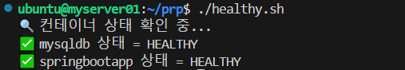
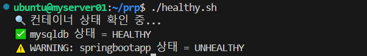
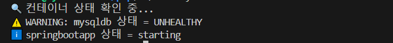

<div align="center">
<h1 style="font-size: 36px;">🚀 Docker-Spring-AutoBackup</h1>
</div>
</br>

## 목차
1. [🙆🏻‍♂️ 팀원](#%EF%B8%8F-팀원)
2. [❤️ 프로젝트 개요 - Docker를 활용한 Spring Boot 배포](#%EF%B8%8F-프로젝트-개요---docker를-활용한-spring-boot-배포)
3. [🛠 미션 수행 과정](#-미션-수행-과정)
4. [📚 프로젝트를 통해 배운 점](#-프로젝트를-통해-배운-점)

## 🙆🏻‍♂️ 팀원

#### 팀명 : 아프지말아조
우리FISA 4기 클라우드 엔지니어링 아프지말아조팀

|||||
|:-:|:-:|:-:|:-:|
|김예진<br/>[@yeejkim](https://github.com/yeejkim)|이슬기<br/>[@seulg2027](https://github.com/seulg2027)|이은준<br/>[@2EunJun](https://github.com/2EunJun)|정파란<br/>[@BlueRedOrange](https://github.com/BlueRedOrange)|

---

<br>

## ❤️ 프로젝트 개요 - Docker를 활용한 Spring Boot 배포

**프로젝트 개요** <br/>
- `Docker-Compose`를 활용하여 image를 한 번에 관리하기
- Docker의 상태를 저장하지 못하는 Docker 환경에서 따로 DB의 로그 파일을 저장함으로써 Docker의 보완책 찾기
- Container 내에 `NFS Directory`를 만들고 해당 폴더에 자동으로 백업하는 환경 구성하기

**왜 NFS를 사용했는가?** <br/>
- 네트워크를 통해서 **팀원 간 동일한 파일 시스템을 공유**할 수 있기 때문에, 볼륨 마운트나 바인드 마운트보다 확장성이 높다고 판단
- 데이터 저장소를 중앙 집중형으로 관리 가능하기 때문에 단일 서버에서 모든 데이터를 관리할 수 있음

**전체 프로세스**<br/>
1️. Spring Boot 애플리케이션(springbootapp)이 /app/logs/에 로그(app.log)를 생성
2️. 1분마다 크론탭(moveLogs.sh)이 실행 → /app/logs/에 있는 로그를 /mnt/log-volumes/app-logs/로 이동
3️. 로그 파일이 NFS 마운트된 경로(/mnt/log-volumes/app-logs/)로 이동됨 → 클라이언트에서도 확인 가능
4️. 1분마다 크론탭(checkCondition.sh)이 실행 → mysqldb, springbootapp 컨테이너 상태를 체크


## 🛠 미션 수행 과정

### 1️⃣ Spring log 파일 설정하고 Container로 올리기

Spring의 어플리케이션 로그파일들을 수집할 수 있도록 `logback` 을 사용한다.

```xml
<?xml version="1.0" encoding="UTF-8"?>
<configuration>

    <!-- 콘솔 로그 설정 -->
    <appender name="CONSOLE" class="ch.qos.logback.core.ConsoleAppender">
        <encoder>
            <pattern>%d{yyyy-MM-dd HH:mm:ss} [%thread] %-5level %logger{36} - %msg%n</pattern>
        </encoder>
    </appender>

    <!-- 파일 로그 설정 -->
    <appender name="FILE" class="ch.qos.logback.core.rolling.RollingFileAppender">
        <file>logs/app.log</file>
        <rollingPolicy class="ch.qos.logback.core.rolling.TimeBasedRollingPolicy">
            <fileNamePattern>logs/app-%d{yyyy-MM-dd}.log</fileNamePattern>
            <maxHistory>7</maxHistory> <!-- 로그 파일 보관 일수 -->
        </rollingPolicy>
        <encoder>
            <pattern>%d{yyyy-MM-dd HH:mm:ss} [%thread] %-5level %logger{36} - %msg%n</pattern>
        </encoder>
    </appender>

    <!-- 기본 로그 레벨 설정 -->
    <logger name="org.springframework" level="INFO"/>
    <logger name="edu.fisa.ce" level="DEBUG"/>
    <logger name="org.hibernate.SQL" level="DEBUG"/>
    <logger name="org.hibernate.type.descriptor.sql.BasicBinder" level="TRACE"/>

    <!-- 로그 출력 (콘솔 + 파일) -->
    <root level="INFO">
        <appender-ref ref="CONSOLE"/>
        <appender-ref ref="FILE"/>
    </root>

</configuration>
```

해당 로그를 Docker-Compose 안의 NFS 서버로 옮긴다. 로그를 테스트 가능한 URL은 다음과 같다.

<details>
<summary> 👻 info 로그 테스트</summary>

```
# info 로그 테스트
curl http://{ip}:8080/log/info

# warn 로그 테스트
curl http://{ip}:8080/log/warn

# error: 잘못된 숫자 입력
curl "http://{ip}:8080/log/error?number=0"

# 전체 흐름 테스트, 이름이 짧을 경우 INFO, WARN발생
curl "http://{ip}:8080/log/check-user?username=ab"

# username=fail일 경우 error 발생
curl "http://{ip}:8080/log/check-user?username=fail"
```
</details> <br/>

위의 명령어들을 통해 로그를 발생시켰다.

```sh
#!/bin/bash

LOG_DIR="./logs" # 로그 파일이 위치한 디렉토리
DEST_DIR="/mnt/log-volumes/app-logs" # 이동할 대상 디렉토리

# 대상 디렉토리가 없으면 생성
mkdir -p "$DEST_DIR"

# 로그 파일 이동
mv "$LOG_DIR"/*.log "$DEST_DIR"

# 결과 출력
if [ $? -eq 0 ]; then
    echo "✅ 로그 파일들이 $DEST_DIR 로 이동 완료!"
else
    echo "❌ 로그 파일 이동 실패!"
fi
```


### 2️⃣ NFS 서버 및 클라이언트 구성하기

#### NFS 서버 구성 

NFS 서버를 구성하기 위해서 Ubuntu에서 아래 명령어를 실행한다.

```bash
$sudo apt update && sudo apt upgrade -y
$sudo apt install nfs-kernel-server

# NFS 서버 추가
$sudo systemctl start nfs-kernel-server
$sudo systemctl enable nfs-kernel-server

# 루트 디렉터리 및 공유 마운트 지점 설정
$sudo mkdir -p <마운트 지점>

# 디렉터리 마운트를 공유 마운트 지점에 바인딩
$sudo mount --bind <마운트 지점>

# 접근 허용할 클라이언트 IP 설정
$sudo nano /etc/exports

/srv/nfs4         *(rw,sync,no_subtree_check,crossmnt,fsid=0)
/srv/nfs4/backups *(rw,sync,no_subtree_check)
/srv/nfs4/www     *(rw,sync,no_subtree_check)

# 설정 업데이트
$sudo exportfs -ar 
# 설정 확인
$sudo exportfs -v
```


#### NFS 클라이언트 구성 

```
# 클라이언트 서버 설치 
$sudo apt update
$sudo apt install nfs-common

# 마운트 확인
$shomount -e <NFS서버 IP>

```


`docker-compose.yml` 파일에 NFS 서버의 파일 경로를 설정한다.

```yaml
...

volumes:
  my_nfs_volume:
    driver: local
    driver_opts:
      type: "nfs"
      o: "addr=192.168.88.160,rw"
      device: ":/mnt/nfs_shared"
```


### 3️⃣ Container 상태 체크하기

Container가 Healthy 상태인지 체크하는 코드를 crontab에 등록하여 Container의 상태를 주기적으로 체크한다.

```bash
#!/bin/bash

CONTAINER_DB_NAME="mysqldb"
CONTAINER_APP_NAME="springbootapp"

STATUS=$(docker inspect --format='{{.State.Health.Status}}' $CONTAINER_NAME)

if [ "$STATUS" == "unhealthy" ]; then
    echo "⚠️ WARNING: $CONTAINER_NAME is UNHEALTHY!"
else
    echo "✅ $CONTAINER_NAME is $STATUS"
fi

APP_STATUS=$(docker inspect --format='{{.State.Health.Status}}' $CONTAINER_APP_NAME)

if [ "$APP_STATUS" == "unhealthy" ]; then
    echo "⚠️ WARNING: $CONTAINER_APP_NAME is UNHEALTHY!"
else
    echo "✅ $CONTAINER_APP_NAME is $APP_STATUS"
fi
```
- 정상적인 상태


> mysqldb & springbootapp 정상 구동 확인

- 비정상적인 상태


> mysqldb 정상 & springbootapp 비정상 확인



> mysqldb 비정상 & springbootapp 구동 확인

---

### 4️⃣ 로그 파일을 NFS 마운트된 디렉터리로 이동시키기

발생한 로그 파일이 NFS 통해 마운트된 디렉터리로 이동하는지 확인하는 코드를 crontab에 등록하여 상태를 주기적으로 체크한다.

```
#!/bin/bash

LOG_DIR="./logs" # 로그 파일이 위치한 디렉토리
DEST_DIR="/mnt/log-volumes/app-logs" # 이동할 대상 디렉토리

# 대상 디렉토리가 없으면 생성
mkdir -p "$DEST_DIR"

# 로그 파일 이동
mv "$LOG_DIR"/*.log "$DEST_DIR"

# 결과 출력
if [ $? -eq 0 ]; then
    echo "✅ 로그 파일들이 $DEST_DIR 로 이동 완료!"
else
    echo "❌ 로그 파일 이동 실패!"
fi

```


5️⃣ Crontab 등록 

위 두 가지 파일을 주기적으로 실행시키도록 crontab에 등록한다. 
```
```


## 📚 프로젝트를 통해 배운 점


